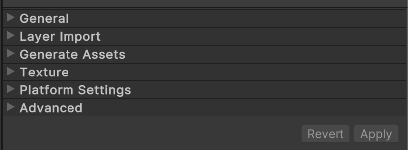
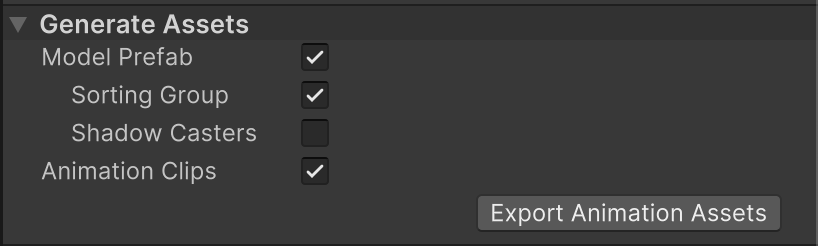
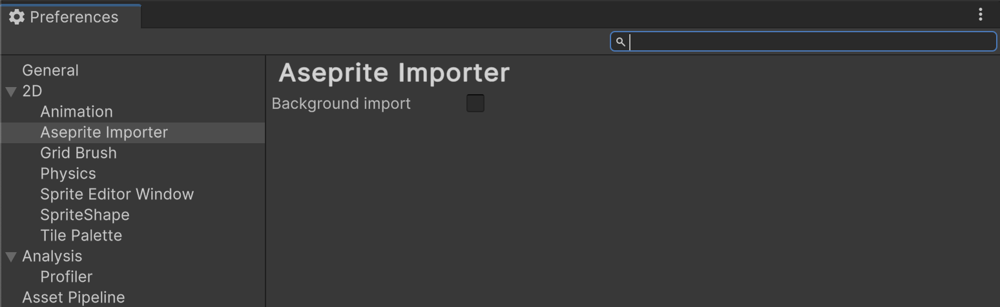

# Importer features

## Default Texture settings

The Aseprite Importer sets the following default settings to the generated texture:
- <b>Texture type:</b> Sprite
- <b>Sprite mode:</b> Multiple
- <b>Pixel per unit:</b> 100
- <b>Mesh type:</b> Tight
- <b>Wrap mode:</b> Clamp
- <b>Filter mode:</b> Point
- <b>Compression:</b> None
- <b>Generate Mip Maps:</b> False

## Aseprite Importer Inspector properties
The Aseprite Importer is available after you import a .ase/.aseprite file into your Project.

  Aseprite Importer Inspector properties

### General

<table>    
  <thead>
    <tr>
      <th colspan="1"><strong>Property</strong></th>
      <th colspan="2"><strong>Description</strong></th>
    </tr>
  </thead>
  <tbody>
    <tr>
      <td rowspan="3"><strong>Import Mode</strong></td>
      <td colspan="2">How the file should be imported. This is set to <b>Animated Sprite</b> by default.</td>
    </tr>
    <tr>
      <td><strong>Sprite Sheet</strong></td>
      <td>The file is imported as a Sprite Sheet, and can be sliced up in the Sprite Editor.</td>
    </tr>
    <tr>
      <td><strong>Animated Sprite</strong></td>
      <td>The file is imported with animation in mind. Animation assets are generated and attached to a model prefab on import.</td>
    </tr> 
    <tr>
      <td rowspan="1"><strong>Pixels Per Unit</strong></td>
      <td colspan="2">Sets the number of pixels that equals one Unity unit.</td>
    </tr>
    <tr>
      <td rowspan="3"><strong>Mesh Type</strong></td>
      <td colspan="2">Sets the Mesh type that Unity generates for the Sprite. This is set to <b>Tight</b> by default.</td>
    </tr>
    <tr>
      <td><strong><a href="https://docs.unity3d.com/Documentation/ScriptReference/SpriteMeshType.FullRect.html">Full Rect</a></strong></td>
      <td>Unity maps the Sprite onto a rectangular Mesh.</td>
    </tr>
    <tr>
      <td><strong><a href="https://docs.unity3d.com/Documentation/ScriptReference/SpriteMeshType.Tight.html">Tight</a></strong></td>
      <td>Unity generates a Mesh based on the outline of the Sprite. If the Sprite is smaller than 32 x 32 pixels, Unity always maps it onto a <b>Full Rect</b> quad Mesh, even if you select <b>Tight</b>.</td>
    </tr>
  </tbody>
</table>

### Layer import

<table>    
  <thead>
    <tr>
      <th colspan="1"><strong>Property</strong></th>
      <th colspan="2"><strong>Description</strong></th>
    </tr>
  </thead>
  <tbody>
    <tr>
      <td rowspan="1"><strong>Include Hidden Layers</strong></td>
      <td colspan="2">Enable this property to include the hidden layers of the .ase/.asperite file in the import. This property is set to <b>False</b> by default.</td>
    </tr>
    <tr>
      <td rowspan="3"><strong>Import Mode</strong></td>
      <td colspan="2">Use this property to specify how the layers from the source file are imported. This property is set to <b>Merge Frame</b> by default.</td>
    </tr>
    <tr>
      <td><strong>Individual Layers</strong></td>
      <td>Every layer per frame generates a Sprite.</td>
    </tr>
    <tr>
      <td><strong>Merge Frame</strong></td>
      <td>This is the default option. All layers per frame are merged into one Sprite.</td>
    </tr>
    <tr>
      <td rowspan="3"><strong>Pivot Space</strong></td>
      <td colspan="2">Select the space pivots should be calculated in. This property is set to <b>Canvas</b> by default.</td>
    </tr>
    <tr>
      <td><strong>Canvas</strong></td>
      <td>Calculate the pivot based on where the Sprite is positioned on the source asset's canvas. This is useful if the Sprite is being swapped out in an animation.</td>
    </tr>
    <tr>
      <td><strong>Local</strong></td>
      <td>This is the normal pivot space used when importing a standard image in Unity.</td>
    </tr>
    <tr>
      <td rowspan="1"><strong>Pivot Alignment</strong></td>
      <td colspan="2">How a Sprite's graphic rectangle is aligned with its pivot point. This property is set <b>Bottom</b> by default.</td>
    </tr>   
    <tr>
      <td rowspan="1"><strong>Sprite Padding</strong></td>
      <td colspan="2">Internal padding within each SpriteRect generated from the Aseprite file. This property is set <b>0</b> by default.</td>
    </tr>      
  </tbody>
</table>

### Generate assets

<table>    
  <thead>
    <tr>
      <th colspan="1"><strong>Property</strong></th>
      <th colspan="2"><strong>Description</strong></th>
    </tr>
  </thead>
  <tbody>
    <tr>
      <td rowspan="1"><strong>Model Prefab</strong></td>
      <td colspan="2">Enable this property to generate a model prefab setup to look like the first frame in Aseprite. This property is set to <b>True</b> by default.</td>
    </tr>
    <tr>
      <td rowspan="1"><strong>Sorting Group</strong></td>
      <td colspan="2">Add a Sorting Group component to the root of the generated model prefab if it has more than one Sprite Renderer. This property is set to <b>True</b> by default.</td>
    </tr>    
    <tr>
      <td rowspan="1"><strong>Shadow Casters</strong></td>
      <td colspan="2">Enable this property to add Shadow Casters to all GameObjects with a SpriteRenderer. This property is set to <b>False</b> by default. Note that this checkbox is only available in Unity 2023.1 and newer.</td>
    </tr>
    <tr>
      <td rowspan="1"><strong>Animation Clips</strong></td>
      <td colspan="2">Enable this property to generate Animation Clips based on the frame data in the file. Every tag in Aseprite generates one Animation Clip. If no tag is present, one Animation Clip is generated which covers all frames in the file. The Animation speed is based on the Constant Frame Rate defined in Aseprite. The length is based on the number of frames included in the tag/file. This property is set to <b>True</b> by default.</td>
    </tr>   
    <tr>
      <td rowspan="1"><strong>Export Animation Assets</strong></td>
      <td colspan="2">The Animator Controller and the Animation Clips are generated as Read Only assets. This option can be used to export editable versions of these assets.</td>
    </tr>        
  </tbody>
</table>

## Aseprite Importer Preferences
The Aseprite Importer Preferences can be found at <b>Unity > Settings > 2D > Aseprite Importer</b>.

  Aseprite Importer Preferences

<table>    
  <thead>
    <tr>
      <th colspan="1"><strong>Property</strong></th>
      <th colspan="2"><strong>Description</strong></th>
    </tr>
  </thead>
  <tbody>
    <tr>
      <td rowspan="1"><strong>Background import</strong></td>
      <td colspan="2">Enable this property to enable asset import when the Unity Editor is in the background. This property is set to <b>True</b> by default.</td>
    </tr>    
  </tbody>
</table>