# Editor tools and shortcuts

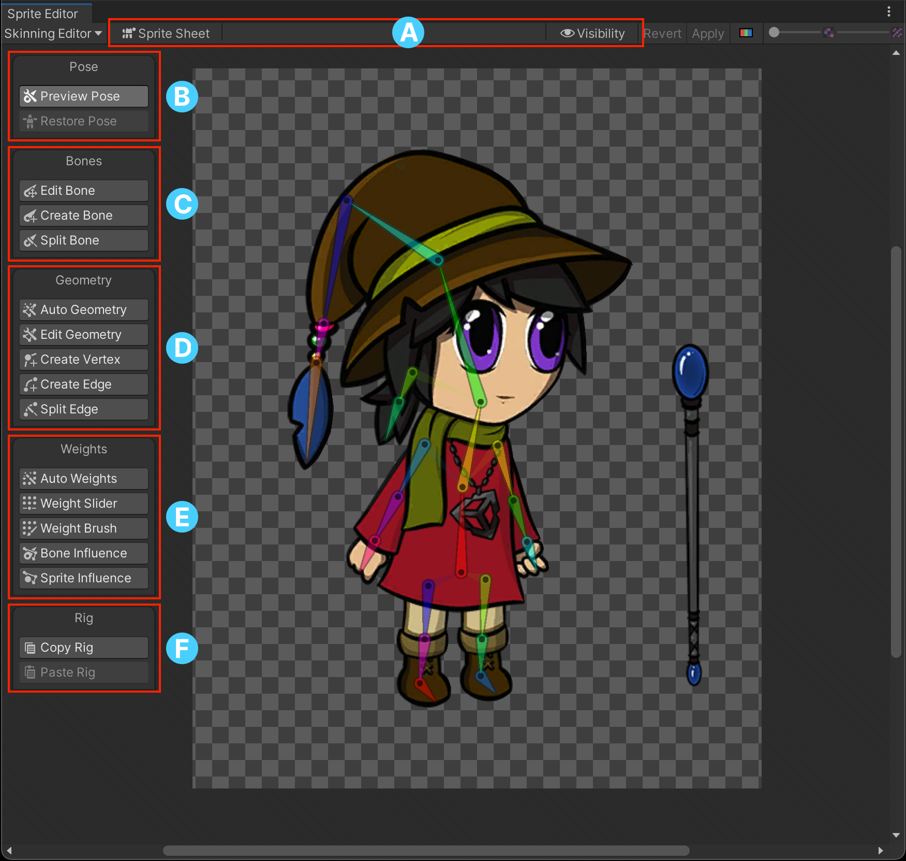 Labelled 2D Animation Skinning Editor tools

The Skinning Editor tools are split-up into the following groups:

A. [Editor toolbar](#editor-toolbar)

B. [Pose tools](#pose-tools)

C. [Bone tools](#bone-tools)

D. [Geometry tools](#geometry-tools)

E. [Weight tools](#weight-tools)

F. [Rig tools](#rig-tools)

## Editor toolbar

This toolbar lets you toggle between __Character__ and __Sprite Sheet__ modes. It also contains the __Visibility__ toggle.

| __Tool__                                                     | __Default Shortcut__ | __Function__                                                 |
| ------------------------------------------------------------ | -------------------- | ------------------------------------------------------------ |
|  __Toggle View Mode__ | Shift + 2            | Switch between the __Character__ and __Sprite Sheet__ view modes. |
|  __Visibility__ | Shift + P            | Toggles the [Sprite visibility panel](SpriteVis.md), which controls the visibility of the Sprite meshes and bones in the editor window. |
| __Toggle Tool Text__                                         | Shift + `            | Show or hide text on tool buttons.                           |

## Pose tools

This is a toolbar that contains the options to __Preview Pose__ and restore the default pose with __Restore Pose__.

| __Tool__                                                     | __Default Shortcut__ | __Function__                                                 |
| ------------------------------------------------------------ | -------------------- | ------------------------------------------------------------ |
|  __Preview Pose__ | Shift + Q            | Enable this mode when moving and rotating an actor's model and joints to preview its poses after rigging. Any changes made in this mode are not saved.                      |
|  __Reset Pose__ | Shift + 1            | Restores an actor's bones and joints to their original positions. |

## Bone tools

Use the __Bone Tools__ to create and edit the bones of your character and their hierarchy.

| __Tool__                                                     | __Default Shortcut__ | __Function__                                                 |
| ------------------------------------------------------------ | -------------------- | ------------------------------------------------------------ |
|  __Edit Bone__   | Shift + W            | Reposition the bones into a new position. These changes are automatically saved as the default bind pose for the Restore Bind Pose tool. Sprite geometry does not deform with the bones in this mode, even if the bones are attached as influencers. |
|  __Create Bone__ | Shift + E            | Click and drag to create bones.                              |
|  __Split Bone__  | Shift + R            | Splits the selected bone.                                    |

### Bone panel

The __Bone panel__ appears at the lower right of the editor window when you select a bone with one of the **Bone Tools** active.

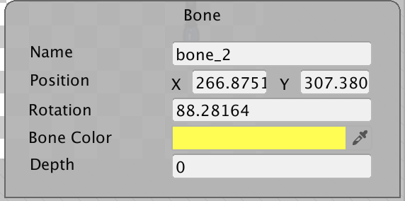

| Property       | Function                                                     |
| -------------- | ------------------------------------------------------------ |
| __Name__       | Displays the name of the selected bone. Enter a new name here to rename the selected bone. |
| **Position**   | The world position of the bone.                              |
| **Rotation**   | The world rotation value of the bone.                        |
| **Bone Color** | The color of the bone.                                       |
| __Depth__      | Displays the Z-value of the selected bone that determines the render order of the vertices under its influence (refer to the examples below). Enter a new value (which can be negative) to change the render order of the affected vertices. Refer to the [bone tab and hierarchy tree](SpriteVis.html#bone-tab-and-hierarchy-tree) documentation for more information on how the **Depth** value affects the way the Sprite mesh is rendered and deformed. |

### Setting the Depth value
The following examples show how the **Depth** value of a selected bone affects the render order of the mesh vertices it influences. In this example, the selected bone (orange) and has an intitial **Depth** value of 1.

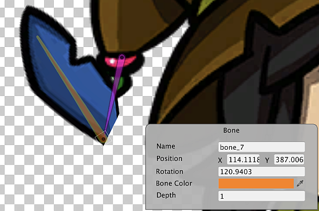
Example 1: With the **Depth** value of 1, the vertices that are influenced by it (the blue are of the Sprite and mesh) appear in front of the other vertices, which have a lower **Depth** value.

However, by setting the bone's **Depth** to -1 instead,

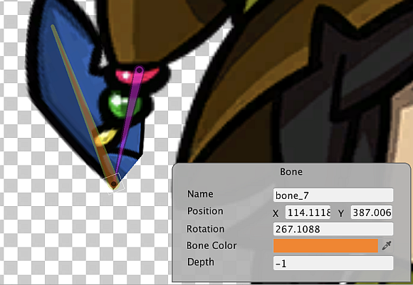
When the selected bone’s **Depth** is set to -1 instead, the vertices that are influenced by it appears behind of the other vertices.

## Geometry tools

Use the __Geometry tools__ to generate and edit the meshes of the different Sprites that make up your character.

| __Tool__                                                     | __Default Shortcut__ | __Function__                                                 |
| ------------------------------------------------------------ | -------------------- | ------------------------------------------------------------ |
|  __Auto Geometry__ | Shift + A            | Select to auto-generate meshes for Sprites. When this tool is selected, the [Geometry panel](#geometry-panel) becomes available at the lower right of the __Skinning Editor__. |
|  __Edit Geometry__ | Shift + S            | Edit generated meshes by repositioning vertices.             |
|  __Create Vertex__ | Shift + D            | Create new vertices to create geometry.                      |
|  __Create Edge__ | Shift + G            | Create new edges to create geometry.                         |
|  __Split Edge__  | Shift + H            | Split an existing edge into two.                             |

### Geometry panel

The __Geometry panel__ is only visible when __Auto Geometry__ is enabled. It contains the available settings that affect how the geometry of selected Sprites are generated.

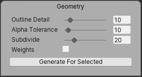 Visible only when **Auto Geometry** is enabled.

| __Property__                                       | __Function__                                                 |
| -------------------------------------------------- | ------------------------------------------------------------ |
| __Outline Detail__                                 | Use the slider to adjust the accuracy of the generated geometry’s outline to the outline of the Sprite. Smaller values create simpler outlines, while larger values create denser outlines that fit to the Sprite’s outline more accurately. |
| __Alpha Tolerance__                                | Use the slider to set the alpha value threshold to consider when generating geometry. Pixels with an alpha value lower than the set tolerance value are considered transparent during outline detection when the geometry is generated. |
| __Subdivide__                                      | Use the slider to adjust the tessellation of the Sprite mesh by adding or decreasing the number of vertices inside the generated mesh. |
| __Weights__                                        | Enable to automatically assign weights between the generated geometry mesh and nearby bones. |
| __Generate For Selected/Generate For All Visible__ | Select this button to generate a geometry mesh for selected Sprites based on the property settings above. To generate geometry for all Sprites in the Skinning Editor, do not have any Sprite selected when you select this button. |

## Weight tools

Vertices in the generated geometry meshes are influenced by different bones which affect how the meshes deform during animation. The percentage of influences from different bones for each vertex is contained in the weight information assigned to that vertex, which you can control with the following Weight tools.

To add weights to your Sprites, you can first ensure that there are [bones](#bone-tools) overlaying the Sprites and [geometry](#geometry-tools) has been generated.

| __Tool__                                                     | __Default Shortcut__ | __Function__                                                 |
| ------------------------------------------------------------ | -------------------- | ------------------------------------------------------------ |
|  __Auto Weights__ | Shift + Z            | Auto-generate weights between the geometry and bones. When this tool is selected, the [Weights panel](#weights-panel) becomes available at the lower right of the __Skinning Editor__ that displays the available settings and the option to generate weights for. |
|  __Weight Slider__ | Shift + X            | Use the slider to adjust weights.                            |
|  __Weight Brush__ | Shift + N            | Adjust weights by painting with a brush.                     |
|  __Bone Influence__ | Shift + V            | Select which bones influence a Sprite.                       |
|  __Sprite Influence__ | Shift + M      | Select which Sprites are being influenced by a bone.         |

### Weights panel

The Weights panel appears at the lower right of the Sprite Editor window when __Auto Weights__ under the Weight tools is selected.

| __Property__              | __Function__                                                 |
| ------------------------- | ------------------------------------------------------------ |
| __Associate Bones__       | Select this box to automatically associate bones to the Sprite geometry they overlay. |
| __Generate/Generate All__ | Select this button to generate weights for the currently selected Sprite, or for all Sprites if no Sprite is selected. This does not do anything if [geometry has not been generated](#geometry-tools) for the Sprites, or if no bones are associated with the Sprite geometry. |
| __Normalize__             | Normalizes the weights of the selected Sprite, or all Sprites if no specific Sprite is selected. |
| __Clear__                 | Clear the weights of the selected Sprite, or of all Sprites if no specific Sprite is selected. |

### Weight Slider

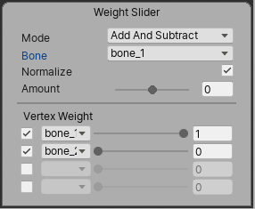

| __Property__                                | __Function__                                                 |
| ------------------------------------------- | ------------------------------------------------------------ |
| __Mode__                                    | The current behavior of the __Weight Slider__ tool.          |
| &nbsp;&nbsp;&nbsp;&nbsp;Add and Subtract    | Select this mode to have all sliders influence all vertices around the selected bone (currently displayed in the **Bone** property). |
| &nbsp;&nbsp;&nbsp;&nbsp;Grow and Shrink     | Select this mode to have all sliders influence only vertices that are already affected by the selected bone (which is selected in the **Bone** property). |
| &nbsp;&nbsp;&nbsp;&nbsp;Smooth              | Averages the weights of all vertices with their neighbors to create an even distribution of weight across all vertices. |
| __Bone__ (unavailable if __Mode > Smooth__) | Displays the currently selected bone. Use the drop-down menu to select a different bone, or select another bone. |
| __Normalize__                               | Select this to ensure the total normalized weight of all vertices of a selected Sprite mesh is equal to one. |
| __Amount__                                  | Amount of weight applied on selected vertices.               |
| __Vertex Weight__                           | Adjust the bone weights of selected vertices.                |

### Weight Brush

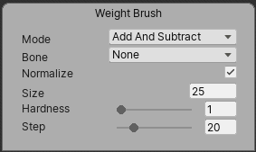

| __Property__                             | __Function__                                                 |
| ---------------------------------------- | ------------------------------------------------------------ |
| __Mode__                                 | The current behavior mode of the weights tool.               |
| &nbsp;&nbsp;&nbsp;&nbsp;Add and Subtract | Select this mode to have all sliders  influence all vertices around the selected bone. |
| &nbsp;&nbsp;&nbsp;&nbsp;Grow and Shrink  | Select this mode to have all sliders influence only vertices that are already affected by the selected bone. |
| &nbsp;&nbsp;&nbsp;&nbsp;Smooth           | Averages the weights of vertices with their neighbors to create a smoother distribution of weights. |
| __Bone__                                 | The bone that the Brush is painting influence for. Select a different bone via the drop-down menu. |
| __Normalize__                            | Enable to ensure the normalized weight of painted vertices will equal to 1. |
| __Size__                                 | Size of the weight brush cursor.                             |
| __Hardness__                             | Amount of weight applied by the brush per brushstroke. Higher values increase the weight per brushstroke, up to the maximum of 100 where the full weight is applied at once. |
| __Step__                                 | Number of increments needed to apply the full weight of brush. |

### Bone Influences panel

The __Bone Influences panel__ displays a list of bones that are currently influencing the selected Sprite mesh.

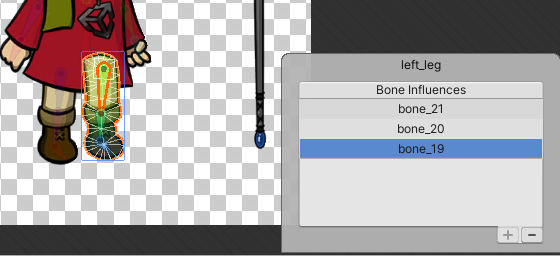

When the Skinning Editor is set to [Character mode](#editor-toolbar), the Bone Influences panel allows you to add a bone to the list which includes its influence in the deformation of the selected Sprite’s mesh, or remove a bone from the list which removes its influence instead.

To add a bone to the list, select the bone in the __Skinning Editor__ window and then select __Add (+)__ at the lower right of the panel. To remove a bone from the list, select the bone in the list or in the editor window and then select __Remove (-)__.

#### Rearranging bone order

You can rearrange the bone order in the Bone Influences panel by selecting and the dragging the respective bone entries up or down the list.

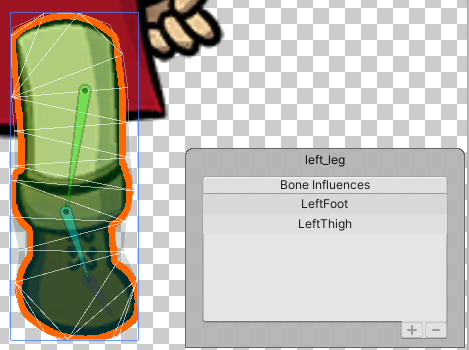

The order of the bones in the Bone Influences panel determines the order of the bones on the __Sprite Skin__ component. This is especially important when replacing the Sprite for deformation in the __Sprite Renderer__, such as when using [Sprite Swap](SpriteSwapIntro.md), as you can ensure the bone order remains the same between the Sprites and that the correct Transform drives the correct deformation.

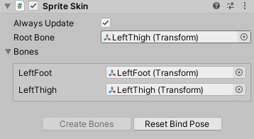

### Sprite Influences panel

 The __Sprite Influences panel__ displays a list of Sprite meshes that are currently being influenced by the selected bone.

 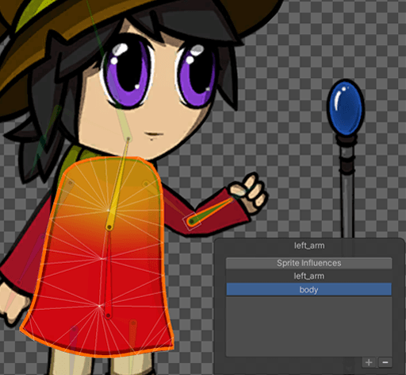

 When the __Skinning Editor__ is set to [Character mode](#editor-toolbar), the Sprite Influences panel allows you to remove an unwanted Sprite mesh from the list so that it’s not influenced by the selected bone. It’s also possible to add a selected Sprite to the list which will include the selected bone’s influence in its deformation.

 To add a Sprite mesh to the list, select the bone in the Skinning Editor window as well as the Sprite you want to add, and then select __Add (+)__ at the lower right of the panel. To remove a Sprite from the list, select it  in the list or in the editor window and then select __Remove (-)__.

## Rig tools

The __Rig tools__ contain the option to __Copy__ and __Paste__ bones from and into a skeleton rig.

| __Tool__                                                     | __Default Shortcut__ | __Function__                                                 |
| ------------------------------------------------------------ | -------------------- | ------------------------------------------------------------ |
|  __Copy__                   | Ctrl + C             | Copies the bone and mesh data from the current selection.    |
|  __Paste__                | Ctrl + V             | Pastes the copied bone and mesh data to the current selection. |
|  __Paste__                | Shift + B            | Use this shortcut to show additional pasting options.        |

## Copy and Paste behavior
Once you have [rigged the skeleton and bone weights](CharacterRig.md) of your actor, you can reuse the same rigged skeleton with other Model Prefabs by using the **Copy** and **Paste** options on the [Rig tools](SkinEdToolsShortcuts.md#rig-tools). This is useful if you need to quickly create characters that share the same build and animations.

You can only Copy and Paste if the source and destination Model Prefabs have the same number of Sprites and Sprite names. When you Copy and Paste the bone and mesh data, the following occurs:

1. Copied bone data is pasted to the destination.
2. Mesh, weights, and bone association of source Sprite(s) are pasted to destination Sprite(s) with the same names.

### Copy behavior
To copy sprite data, select a sprite and then select __Copy__. This copies the mesh and bone data associated with that sprite. If no sprite is selected, then this copies the data of all sprites' currently in the [Skinning Editor](SkinningEditor.md) window instead.

### Paste behavior
To paste copied sprite data, select the __Paste__ button. This opens the Paste panel at the lower right of the editor window which contains the following data options. Select which data you want to paste from the copied sprite data.

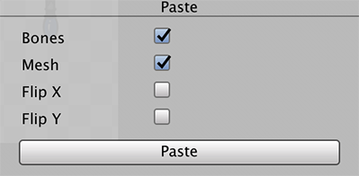 Paste dialog box.

| __Option__ | Function                                      |
| ---------- | --------------------------------------------- |
| __Bones__  | Paste bone data.                              |
| __Mesh__   | Paste mesh data.                              |
| __Flip X__ | Paste the data but mirrored along the X-axis. |
| __Flip Y__ | Paste the data but mirrored along the Y-axis. |

To paste copied sprite data, select a sprite and then select __Paste__. This pastes the selected data to a selected sprite. If no sprite is selected, then this pastes the data to all sprites’ currently in the [Skinning Editor](SkinningEditor.md) window with the same name as the copied sprite.
