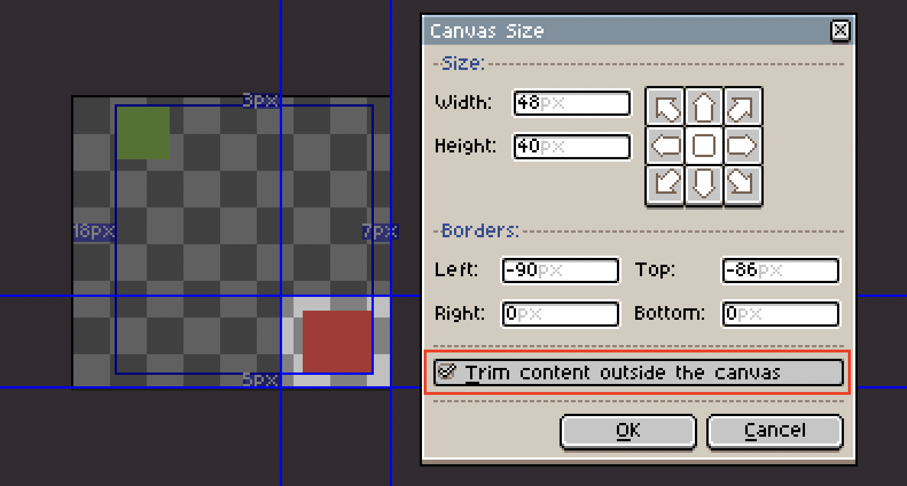
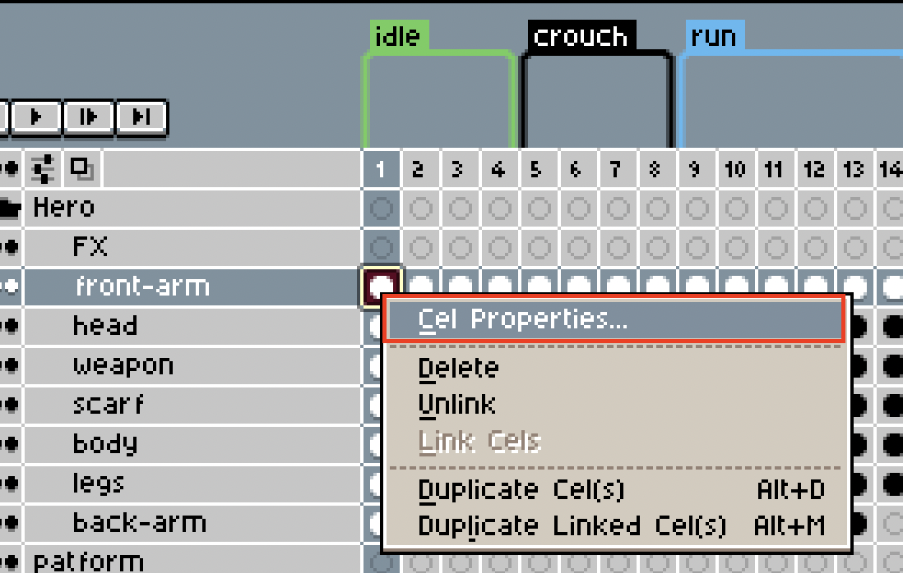
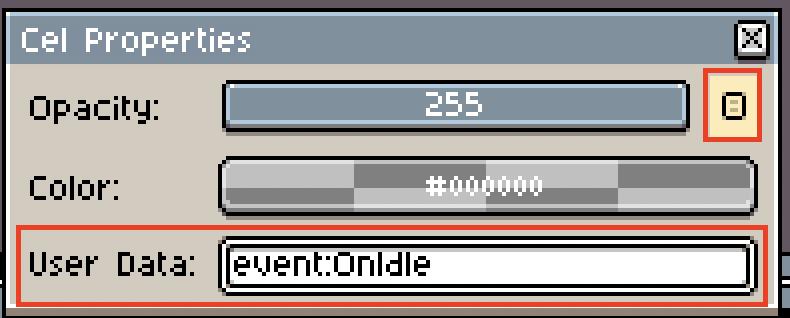
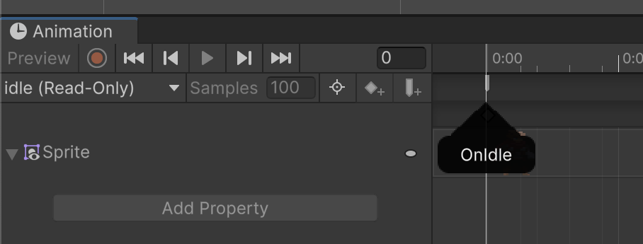
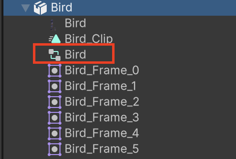
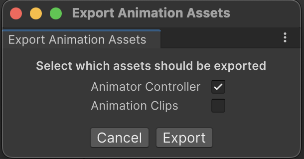

# Frequently asked questions

## How to combine multiple sprite sheets into one?
You can make use of Sprite Atlases to combine multiple sprite sheets into a single texture. Read more about Sprite Atlas [here](https://docs.unity3d.com/2021.3/Documentation/Manual/class-SpriteAtlas.html). Combining multiple sprite sheets into one is a good way to reduce the draw calls in a scene.  

## Why is my trimmed Aseprite file not trimmed in Unity?
When modifying the [canvas size](https://www.aseprite.org/docs/canvas/#canvas-size), make sure the **Trim content outside the canvas** checkbox is checked. This way, the stored texture will be cropped to the specified size.



## How to add events to Animation Clips?
[Animation Events](https://docs.unity3d.com/Manual/script-AnimationWindowEvent.html) can be generated by adding user data to Cels inside of Aseprite.

Follow these steps to add an Animation Event to a frame:

* In Aseprite, select any cel in the frame you want to add an event to.
* Right click on the cel and select **Cel Properties**.



* Press the **User Data**-button to the left of the **Opacity** slider to bring up the **User Data**-field.



* Enter the event name in the following format: **event:EventName**. E.g. **event:OnIdle**.

* Save the file and switch over to Unity.

* Open the Animation Window and inspect the Animation Clip. You can see that the event has been added to the frame.



## How to make changes to an Animator Controller?
The Aseprite Importer generates an Animator Controller if the Aseprite file contains more than one frame and the **Animation Clip** checkbox is checked in the importer. This Animator Controller is Read Only, meaning that it cannot be changed. 



The Animator Controller is Read Only.

If you like to have an Animator Controller which you can change, follow these steps:

* Select an Aseprite file in Unity.
* Press the **Export Animation Assets**-button.
* In the popup, make sure the **Animator Controller** checkbox is checked. Leave the **Animation Clips** checkbox unchecked if you do not wish to edit any of the clips.
* Press **Export** and select a folder to place the Asset(s) into.



An Animator Controller should now be located in the selected folder. If the Animation Clip checkbox was left unchecked, all the states within the Animator Controller are linked back to the Aseprite file, meaning that the clips will stay up to date with any changes made in Aseprite. 

Do note that if you add a new [tag](https://www.aseprite.org/docs/tags/) in Aseprite, you need to add the resulting Animation Clip to the exported Animator Controller, as this will not happen automatically.

## How to inject custom assets on import?
The Aseprite Importer comes with an event, OnPostAsepriteImport, which is fired at the end of the import process. This event can be used to inject or change the generated assets when importing an Aseprite file. 

```CSharp
using UnityEditor;
using UnityEditor.U2D.Aseprite;
using UnityEngine;

public class GameObjectInjector : AssetPostprocessor
{
    void OnPreprocessAsset()
    {
        if (assetImporter is AsepriteImporter aseImporter)
            aseImporter.OnPostAsepriteImport += OnPostAsepriteImport;
    }

    static void OnPostAsepriteImport(AsepriteImporter.ImportEventArgs args)
    {
        var myGo = new GameObject("MyGameObject");
        args.context.AddObjectToAsset(myGo.name, myGo);
    }
}
```